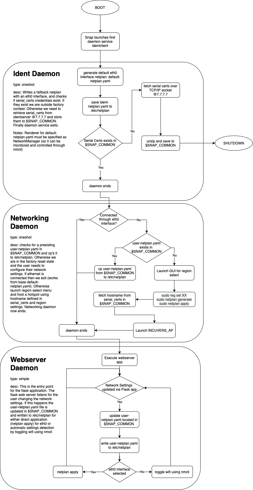

# Daemon Services

The system startup sequence is governed by daemon services. There are 3 main system states we have to configure the system startup sequence for:
1. Factory
2. Client first-time system unboxing
3. Client startup

Each daemon service is responsible for a component of the startup sequence in order to account for all these startup environments. Furthermore we consider the combinations of startup sequences that can occur during the system lifecycle:
1. Factory > Client first-time > Client startup
2. Factory > Client first-time > Client startup > Client first-time > ...
   
We define factory reset to identify the circumstances that a client resets the system so that it can be sold second hand and reopened with the Client first-time boot sequence. 

The system can never be reset to factory so once the factory startup sequence is complete it should not be re-executed. In the event that the client machine fails to read the credentials we can add an endpoint for us to reassign them new credentials. For privacy reasons we do not want to backup their AWS credentials in our databases in case we get compromised the clients data will remain safe.

There are 3 daemons which constitute the startup sequence and flask app execution:
1. identclient (responsible for factory level startup)
2. user-network (responsible for client first-time startup)
3. webserver (responsible for executing app)

The flowchart below details the responsiblities of each daemon in the context of the startup sequence. This was designed in order to meet the system life-cycle requirements and maintain a safe backup networking solution through an `eth0` interface so the user is never locked from the network.

## High Level Sequences:

1. default `50-cloud-init.yaml` file only contains `eth0` interface
2. `identclient` daemon executes on boot and connects to 7.7.7.7 and retrieves `serial_certs` with device credentials and `hostname`
3. `identclient` launches AP using `hostname` using `nmcli hotspot ifname wlan0 ssid INCUVERS_AP password "incuvers1234"`
4. `identclient` daemon teminates
5. `webserver` daemon launches and spins up `Flask`
6. User connects to `Flask` webserver using `hostname:port` (port needs to be defined somehow)
7. User opens networking tab and selects wifi dropdown which is populated using `nmcli device wifi list`
8. User selects wifi it wants to connect to and enters password and these credentials get written to `user-netplan.yaml` which must specify `NetworkManager` as its renderer
9. Reset wlan0 interface by turning off the wifi connection using nmcli radio wifi off followed by nmcli radio wifi on
10. User is connected to their specified wifi access point as described by newly generated `user-netplan.yaml`

