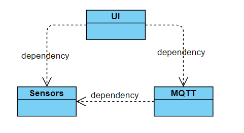
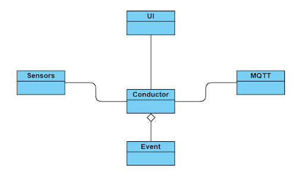

# Event Handler Design Pattern

Updated: 2020-07

This technical overview is deprecated but kept for reference purposes. For the updated manuscript see the README

## Navigation
 1. [Abstract](#abstract)
 2. [Event-Driven Architecture](#event-driven-architecture)
 3. [Custom Exceptions](#custom-exceptions)
 4. [Developer Notes](#developer-notes)

## Abstract
This document details the implementation of the event based driven design in technical detail in order to illustrate a logical blueprint of what is concurrently implemented in IRIS

Core Concepts:
 - Protected state variables required external access breaking encapsulation causing problems for scalability and maintenance. 
 - Remove code that calls outside its lexical scope and employ something more elegant and easier to follow from a top-down perspective
 - `event.py` and `event_handler.py` modules holds all internal logic and event states in memory during run-time.
 - `event.py` creates event objects by binding event types to function callbacks and declaring method signatures for when the event is triggered.
 - `event_handler.py` is the event control logic responsible for rejecting or accepting the registration and triggering of events
 - Event objects are registered (`event_handler.register`) then triggered (`event_handler.trigger`) to execute their callbacks


## Seperation of Concerns
In order to understand the advantages of the event-driven architecture we need to understand the problems created by a complex multi-component real time system. The purpose of creating classes is to provide separation of methods relative to a specific instance. However for a tightly knit system, some classes may require methods from other classes. As an example consider a UI class which requires access to definitions defined in Sensors and and MQTT classes:

```python
sensors = Sensors()
mqtt = MQTT(sensors)
ui = UI(sensors,mqtt)
```

In this example, MQTT is a class holding the networking protocols for updating the cloud server with telemetry data. The telemetry data is fetched from the Arduino sensors which is handled by the Sensors class. Finally the UI class requires both sensor and cloud telemetry data for displaying to the user so it must be passed both object instances. The result is a cycle of dependencies:



This model causes objects to be passed into multiple other objects impacting the separation of concerns of methods. This makes it difficult to keep track of  the caller for methods since they can be foreign objects. For example, if a method in Sensors fails, who is the caller and what was the corresponding method signature? These questions are difficult to answer using this model and create difficult debugging problems. Furthermore, this model inhibits system scalability and overall maintenance.

We want to maintain separation of concerns in order to keep each method focused and have a well-defined operational scope. For example, having a method in Sensors executing logic and modifying state variables for MQTT would not only be hard to track, but will cause methods to be executed outside of their intended scope. To enforce better class and method separation the architecture needs to be improved. 

## Event-Driven Architecture

At a fundamental level, event-driven systems rely on a conductor that handles events passed between different objects. In this model, objects cannot directly interact with each other but instead do so using the conductor which manipulates event objects:



Continuing from the previous example, we now have an architecture which eliminates object dependencies by centralizing all out-of-scope method calls into an event conductor. The conductor creates event objects for each type of method request from all connected object components. These event objects are not treated as a scheduler treats requests which means the events are not destroyed once their callbacks are executed. Instead these events in combination with the conductor serve as a system definition for how each callback should be handled. This allows each method to pass a number of system verification checks and trace the caller origin before being executed.

## The Event Object

Every event will have it’s own Event object at the moment there will be currently (16) event objects on the heap that we have access to. With these event objects we access their fields and perform conditional operations and flow control based on the outcomes or values these fields hold.

Events are in essence a service routine defined by a specific callback function. Events are defined by the Event class which enforces event type restrictions and holds the appropriate callback method and signature (i.e. parameters). Events are created by the conductor after it has passed the eligibility criteria pertaining to the corresponding event type logic. The high level class description of event is given below: 

| Field                     | Description                                                                                                                                                                  |
|---------------------------|------------------------------------------------------------------------------------------------------------------------------------------------------------------------------|
| `allowed_types`           | Class constant that stores a list of allowed event types. All event types are defined as uppercase strings (i.e. `SETPOINT_UPDATED`).                            |
| `accessed_type`           | Stores the event type allowing for grouping of like events for live signature checking (see  `method_signature` below) and other performance improvements.                   |
| `unique_class_identifier` | Holds the object caller’s class definition which enables tracing of execution origin. This is treated as an origin tag.                                                      |
| `callback`                | Contains a function to be executed once the event is “triggered”.                                                                                                            |
| `method_signature`        | Stores the parameters for the callback function. This can then be cross-referenced against other  Event objects of the same type to verify the correctness of the signature. |
| `condition`        | Holds a lambda function with a boolean return type defining if this event's callback should be executed during a trigger.  |

In order to provide context for the system-level purpose of the unique_class_identifier and method_signature attributes we must understand the fundamental difference between interpreters and compilers.

### Event Naming Convention

Event naming convention: <NOUN>_<PAST_TENSE_VERB>. The motivation here is to give the nuance that <NOUN> WAS <PAST_TENSE_VERB> and hence we are performing some action as a result. These event names must always be reactive rather than proactive. The events listed below is the full set of allowed types and grouped by action type.

> ### UPDATED
> < noun > happened and here is the context
>> Information Driven: Yes \
>> Infomation Type: Dependant, small packets \
>> Usage: System property was changed
>
> EXPERIMENT_PROGRESS_UPDATED | experiment progress was updated \
> SYSTEM_STATUS_UPDATED | system acton-related status was updated ( icon, feedback msg ) \
> etc ...


> ### FETCHED
> < noun > was requested and here is the information
>> Information Driven: Yes \
>> Infomation Type: Independant, large packets, high overhead to make call, not scheduled \
>> Usage: Return payload from API call
>
> REGISTRATION_KEY_FETCHED | the registration key is fetched from our api \
> DEVICE_NAME_FETCHED | device name fetched from our api \
> etc ...


> ### DISCOVERED
> < noun > was being actively listened for and has happened
>> Information Driven: No \
>> Usage: Shadow delta discovery 
>
> PROTOCOL_REFRESH_DISCOVERED | new protocol is discovered through a refresh shadow delta
> EXPERIMENT_REFRESH_DISCOVERED | new experiment is discovered through a refresh shadow delta \
> etc ...


> ### SET
> < noun > is completed, or requested
>>Information Driven: No \
>>Usage: Directly user driven, some set of actions has been completed
>
> DOOR_HEATER_SET | door heater was requested to be toggled \
> CO2_CALIBRATION_SET | CO2 calibration was requested \
> etc ...

> ### COMPLETED
> < noun > is completed
>> Information Driven: No \
>> Usage: Some set of actions has been completed
>
> PROTOCOL_COMPLETED | protocol has completed \
> EXPERIMENT_COMPLETED | experiment has completed \
> etc ...

### Signature Validation

Python is an interpreted language which means code is checked and executed line-by-line which means that faults within code that is not executed will remain undetected. With respect to the system, this concept is relevant for the method signatures. Since the timing of events triggers are asynchronous, we cannot ensure the validity of events which are registered with, but not triggered by the conductor. This is called dynamic-typed checking which delays verification of the method signatures until the method has to be executed. 

In order to have the method signatures checked in registration, we need to implement static-typed checking as used by C++ compilers. Compiled languages check all code and branches all before execution. This allows faults to be detected before the code is executed. Similarly in our system, inaccuracies in method signatures can cause several runtime errors and is considered an anti-pattern. We want the method signatures to be verified continually in real-time before executing their respective callbacks. This is achieved by utilizing the inspect library which extracts expected data types of the parameters passed to the callback function. 

Furthermore, the inspect library is used to get a unique stack trace of the caller object and it’s hash. We can assume this to be unique to the caller object and we can expect it to behave in a deterministic manner when we inspect it. Therefore, in this manner, we can verify the origin of each event “trigger” using static-typed checking. Details regarding these implementations will follow in the next section.

Finally the Event class is responsible for the following three validation tests upon its instantiation:
**Event type (permitted and object type)**
```python
if not isinstance(accessed_type, str) or accessed_type not in self.allowed_types:
    raise EventTypeError(accessed_type)
```
Event types are described in the implementation as accessed_type and follow the aforementioned guidelines.  Verify that the passed event type exists in the Event class’ allowed_types definition otherwise the event type is not supported by the system.

**Invocation of callback function**
```python
# callback validation
try:
    callback_signature = signature(callback)
except TypeError as exc:
    raise NotCallableError(callback) from exc
```
Verify that the passed callback function can be invoked from the context of the Event class

## The Event Handler

The conductor is defined as the EventHandler object which is responsible for registering events into its internal database and executing all callback functions registered to event triggers. To reiterate, the purpose of the EventHandler is to facilitate hand off of frequent method invocations from a large number of origins. At a high level, the EventHandler is responsible for two primary functions:

1. *Event Registry* through validating Event properties and storing in an internal data structure
1. *Event Trigger* by dispatching Event callback functions

The **callback** tag is: `callback` member of the of the Event object
The **signature** tage is: `method_signature` member of the of the Event object
The **origin** tag is: `unique_class_identifier` member of the of the Event object

The following sections will describe the `EventHandler` methods in detail.

### Registry

For efficient access times to specific event types (described by event.accessed_types) we store the events in a dictionary (`event_registry{}`) with keys describing the event type and a list of associated `Event` objects as a list. The ordered list of events are contained as an attribute within the `EventHandler` object as self.events. To populate we iterate through self.events and attempts to append `Event` objects at a key defined by their `accessed_type`. If the key is unique it will raise `KeyError` creating a new key : value mapping with the `accessed_type` as the key and the `Event` object as the first element in a new list for the value. Otherwise the `Event` is appended to the list associated to its key.

### Register
The primary purpose of a register is to instantiate an Event object and add it to the event queue. When we employ the event handler in a class the minimum requirement is to register the callback functions. We can have just the registration existing solely by itself and then we can have trigger existing by itself there is no reliance in context they need to be both included in the class.

```python
self.event_handler.register('REPORT_DESIRED_TO_CLOUD', callback=self.report_desired_refresh_to_cloud)
```
Callback argument is `report_desired_refresh_to_cloud` and this will wait for the trigger function associated with this event. When this bit of code is run we can assume that ALL of these register functions will be activated meaning their callback function(s) will be invoked and therefore the other logic will execute in the callback method body.

```python
def register(self, accessed_type, callback, condition=None):
    """
    Registers a new event into the event registry. The method creates a new event, verifies the
    signature of the event against a reference event in the registry of the same type and adds 
    it to the registry.

    :param accessed_type: event type classification for registry
    :param callback: function to be executed once the event is triggered
    :param condition: lambda function defining the conditions that the trigger must meet in order
    to execute the callback of this event instance.
    :raise EventTypeError: if event type does not exist in allowed types or event type name
    is not of the correct format
    :raise NotCallableError: if event is registered with an illegal callback function
    :raise SignatureError: if method signature does not match reference method_signature for the
    same event type
    :raise DuplicateRegistryError: When a caller tries to register an event type it has 
    previously registered
    """
    # capture the caller as a frame trace
    try:
        event = Event(
            accessed_type, callback, None, inspect.currentframe().f_back.f_locals['self'], condition)
    except EventTypeError as exc:
        # implicitly sets exc_info = True
        self._logger.exception(exc)
        raise
    except NotCallableError as exc:
        self._logger.exception(exc)
        raise

    # verify event signature against reference
    try:
        self._verify_signature(event)
    except SignatureError as exc:
        self._logger.exception(exc)
        raise
    except DuplicateRegistryError as exc:
        self._logger.exception(exc)
        raise

    # use hash to check for unique events
    try:
        # append to list @ key
        self._event_registry[event.accessed_type].append(event)
    except KeyError:
        # add new key : value pair if accessed_type is unique
        self._event_registry.update({event.accessed_type : [event]})
    self._logger.info(
            "\n\tRegistered: %s\n\tRegisterer: %s\n\tCondition: %s",
            event.accessed_type, event.callback, event.condition)

def _verify_signature(self, event):
    """
    Verify the signature of the new event against reference event of the same type and the
    caller origin is unique within the event_registry
    :param event: newly created event to be tested against the event registry
    :raise SignatureError: if method signature does not match reference method_signature for the
    same event type
    :raise DuplicateRegistryError: When a caller tries to register an event type it has 
    previously registered
    """
    
    a_type = event.accessed_type
    reg = self._event_registry
    # The first instance of an event type serves as the standard for subsequent event type
    # signatures
    if a_type in reg.keys():
        # while all incoming events are checked against the top level event, signature matching
        # will be enforced
        if reg[a_type][0].method_signature != event.method_signature:
            raise SignatureError(reg[a_type][0], event)
        # Verify incoming event has a unique caller origin amongst registered events of the same 
        # type
        # BUG: does not verify the reference signature is correct
        trigger_caller_origin = event.unique_class_identifier
        origin_check = list(filter(
            lambda event : trigger_caller_origin == event.unique_class_identifier, reg[a_type]))
        if len(origin_check) > 0:
            raise DuplicateRegistryError(origin_check.pop(), event)
```

This is what actually happens inside the register function; going right into it we can see there is a param called accessed_type which is the event type ( string ) that we have passed in and a callback which is the callback function.

We can see we create an object called signature in here what this does is performs the necessary logic to “inspect” class and function call information such as hashes and params of the callback function. We then go into the loop and extract the data types that are declared by the developer in the callback function this keeps a copy of the callback and it’s params so we may use this as a safe type checking method and capitalize on it when enforcing the expected signature; as the first one that is added to our dictionary is the “proof” and we can safely assume that all types should enforce the same data type checking/restriction(s).

### Trigger (Event Dispatch)
This function is called from a different class than the registration event ( registration and trigger from the same class is illegal ). Why would we ever want to do this? This is what OOP is for and would make more sense to just access the function or field and respect encapsulation in this context.

We have attempts here that is set to 0 because and executed potentially 3 times and if it cannot be executed we do the appropriate action based on that.

```python
def trigger(self, accessed_type, *argv, **kwargs):
    """
    Executes all callbacks registered with the specified event type (accessed_type). This method 
    first validates trigger args and caller origin then executes all callbacks of a specified
    event type (accessed_type) in the event registry with arguments: argv, kwargs.
    :param accessed_type: callbacks of this event type will execute
    :param argv: callback arguments
    :param kwargs: callback arguments
    :raise UnregisteredEventError: if accessed type does not exist in event registry
    :raise OriginError: if register and trigger caller origin is the same
    :raise CallbackError: when callback function execution raises an exception 
    after max number of attempts defined by EventHandler
    """
    trigger_caller_origin = inspect.currentframe().f_back.f_locals['self']
    # currentframe() capture must stay in trigger since it captures trigger()'s caller
    try:
        event_list = self._verify_trigger(
            trigger_caller_origin, accessed_type)
    except UnregisteredEventError as exc:
        self._logger.exception(exc)
        raise
    except OriginError as exc:
        # continue execution of triggers with the event triggering OriginError removed
        self._logger.warning(exc)
        event_list = exc.updated_event_list
    
    # if self.dispatch is False:
    #     self._logger.info("Caching trigger for event list: %s, using: %s, %s", event_list, argv, kwargs)
    #     self.cache.append(lambda : (lambda fn : fn(event_list, trigger_caller_origin, *argv, **kwargs))(self.exec_callbacks))
    #     self._logger.info("%s", self.cache)
    self._logger.info("Caught trigger: %s, using: %s, %s", accessed_type, argv, kwargs)
    
    try:
        self._exec_callbacks(event_list, *argv, **kwargs)
    except CallbackError as exc:
        self._logger.exception(exc)
        raise

def _verify_trigger(self, trigger_caller_origin, accessed_type) -> list:
    """
    Verify requested event type exists in the event regisry and the caller origin is unique
    amongst the events requested to be triggered.
    :param accessed_type: requested event trigger
    :raise UnregisteredEventError: if accessed type does not exist in event registry
    :raise OriginError: if register and trigger caller origin is the same
    :return event_list: list of events with the requested event type
    """
    # There will be a maximum of one event that may conflict since _verify_signature()
    # enforces that all events with the same event type must have unique class identifiers.
    try:
        event_list = self._event_registry[accessed_type][:]
    except KeyError as exc:
        raise UnregisteredEventError(accessed_type) from exc
    
    origin_check = list(filter(
        lambda event : trigger_caller_origin == event.unique_class_identifier, event_list))
    if len(origin_check) > 0:
        event_list.remove(origin_check[0])
        raise OriginError(origin_check.pop(), trigger_caller_origin, event_list)
    
    return event_list

def _exec_callbacks(self, event_list, *argv, **kwargs):
    """
    Execute callbacks on each event iteratively. If callback execution fails, passover and
    and execute remaining callbacks. For remaining callbacks; iteratvely execute until all 
    callbacks return successfully or have reached the maximum number of callback retries.

    :param event_type: list of events to execute callback functions over
    :param argv: callback arguments
    :param kwargs: callback arguments
    :raise CallbackError: when callback function execution raises an exception 
    after max number of attempts defined by EventHandler
    """
    # self._logger.info("executing callbacks on: %s from trigger origin: %s with arguments: %s, %s", event_list, trigger_caller_origin, argv, kwargs)
    ref_events = {event: 0 for event in event_list}
    # redesign for Queueing solution
    while len(event_list) > 0:
        for event in event_list:
            if event.condition is None or event.condition(*argv,**kwargs):
                try:
                    event.callback(*argv, **kwargs)
                except TypeError as exc:
                    self._logger.exception("callback signature for: %s is incorrect: %s", 
                        event.callback, exc)
                    # if the signature is wrong do not wait for retries
                    raise CallbackError(event, *argv, **kwargs) from exc
                except Exception as exc:
                    # only raise exception when the maximum retries are reached
                    if ref_events[event] > self.CALLBACK_RETRIES:
                        raise CallbackError(event, *argv, **kwargs) from exc
                    ref_events[event] += 1
                    self._logger.warning("callback execution failed: %s - stashed for callback attempt: %s", 
                        event.callback, ref_events[event])
                else:
                    event_list.remove(event)
            else:
                event_list.remove(event)
                self._logger.info("Masked event %s due to not meeting conditional %s", event, event.condition)
```

Execution of event callbacks are conditional on the `event.condition`. If it is defined and resolves to `False` we remove that event from the set of callback executions.


## Custom Exceptions
| Exception                | Description                                                                                                |
|--------------------------|------------------------------------------------------------------------------------------------------------|
| `EventTypeError`         | Event type does not exist in allowed types or event type name is not of the correct format                 |
| `UnregisteredEventError` | Event type does not exist in event registry                                                                |
| `DuplicateRegistryError` | Raised when a caller tries to register an event of a type that has already been registered by that caller. |
| `SignatureError`         | Raised when attempted registry of a method signature does not match reference signature                    |
| `CallbackError`          | Raised when callback function execution after max number of attempts defined by EventHandler               |
| `OriginError`            | Raised when register and trigger source are the same                                                       |
| `NotCallableError`       | Raised when event registration with an illegal callback fails                                              |

## Developer Notes
Before the event-driven approach we essentially we have a very OOP with some hacks thrown in; biggest hack was essentially using booleans to store state and modify this internally for the most part but there were some external modifications of the field state which breaks encapsulation and is not the best way to approach things from a scalability and maintenance standpoint. We quickly realized there is a better way to do things and started exploring different design patterns and ultimately came to a conclusion to employ event based design.

Development of the event-driven architecture involved first understanding how everything would work and then putting the design into practice which proved to be difficult, but ultimately worth it. During development it was tough getting everything to play nice from a logical standpoint as there was heavy refactoring taking place in all 4 major classes. Consequently taking out code in hopes of employing something new brings its own challenges such as the accountability to know and understand where this code is going and what potential places it could go or what could happen. The next thing was uncoupling everything - again in summary we want to remove code that calls far-to-reach places and employ something more elegant and easier to follow at least high level. When uncoupling again we need to know exactly X and Ys relationships; what goes in and what goes out so we may transfer this logic or keep it in consideration when employing our new design pattern.

The guts of this whole process is essentially in event.py and event_handler.py these two classes are what holds all internal logic and state of event(s) in memory during run-time. Event.py is more concerned with the model of the actual data and provides a blueprint if you will of what this object looks like and what we can access; while event_handler.py is the worker in the sense it contains the hard logic that is in charge of rejecting or accepting the registration and triggering of events. All events need to be registered first and can then be triggered ( with the exception of the desired restrictions employed )

